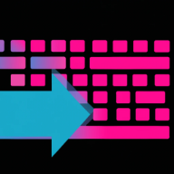

Desktop automation tool including window, keyboard, mouse manipulation.

## Getting started

As of now the library works for Windows desktops.

## Usage

There are different kind of managers that have specific use cases for automation / input manipulation.

* [CursorManager()](lib/src/cursor_manager.dart) for mouse manipulation i.e. move, inputs, pixel color
* [KeyboardManager()](lib/src/keyboard_manager.dart) for keyboard manipulation i.e. sending and remapping keys
* [WindowManager()](lib/src/window_manager.dart) for window manipulation i.e. resize, move, which window is active

Take a look at `example` folder for inspiration.

https://user-images.githubusercontent.com/43004140/188739660-9978ec34-a2f0-431a-9529-cca25db3a534.mp4

## Additional information

Currently building a website at [inputter.dev](https://inputter.dev) and a [scripting language](lib/src/dsl/Compiler.dart) to wrap the automation library.

This library is basically a convenience abstraction around Tim Sneath's [win32](https://github.com/timsneath/win32) wrapper. So big thanks to him and all other contributors to the library!
